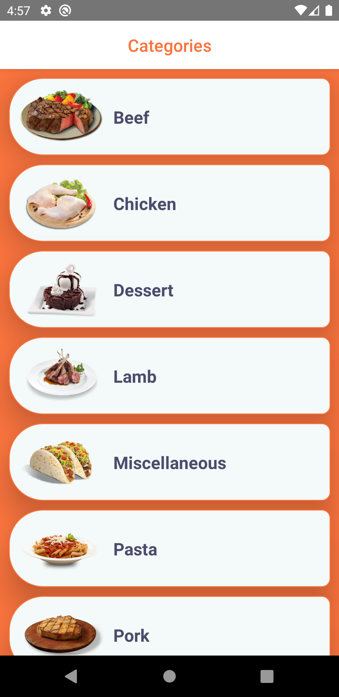
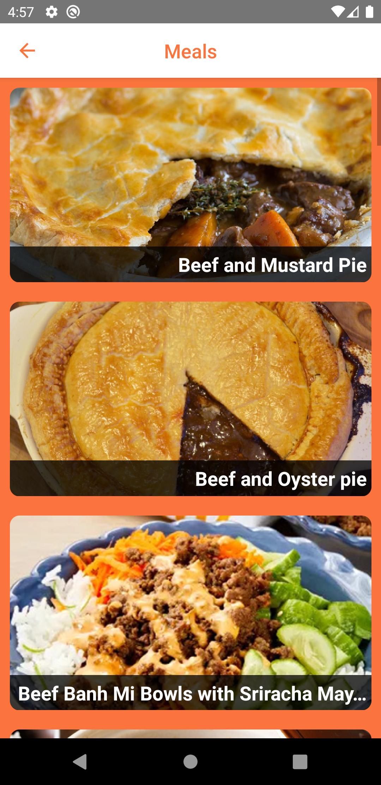
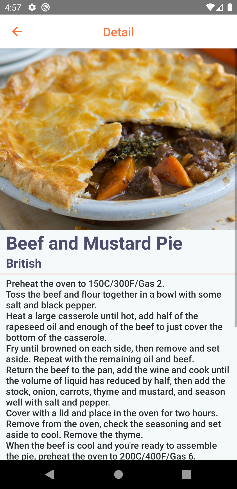
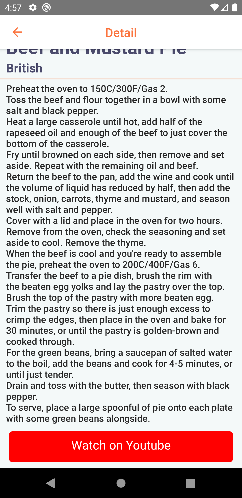

# Tarifka App

 
 
 
 

## Kurulum

React Native

## Tools

- Custom Hooks
- React Navigation
- Lottie

## Özellikler

- API ile dönen kategorileri listeleme.
- Tıklanan kategoriye ait yemekleri listeleme.
- Tıklanan yemeğin detaylarını listeleme.
- API'dan yanıt dönene kadar bir loading ekranı gösterme.
- API'dan olumsuz bir yanıt dönerse bir error ekranı gösterme.

## API

Kullanılan API: TheMealDB

## Başlangıç

Bu depoyu yerel makinenizde klonlayın.

```
git clone https://github.com/ibrahimaykutbas/patika-react-native.git
```

### Kullanım

Projeyi klonladıktan sonra kullanmak için:

```
cd patika-react-native/Tarifka App
cd .
```

Proje bağımlılıklarını yüklemek için proje klasörüne aşağıdaki komutları çalıştırın.

```
npm init
npm install
```

Bu talimatlar, geliştirme ve test amacıyla yerel makinenizde projenin bir kopyasını hazır ve çalışır hale getirecektir.

## Kullanılabilir Komut Dosyaları

Proje dizininde şunları çalıştırabilirsiniz:

```
npx react-native run-android
```

## Daha Fazla Bilgi İçin

Daha fazlasını şuradan öğrenebilirsiniz: [React documentation](https://reactnative.dev/)
